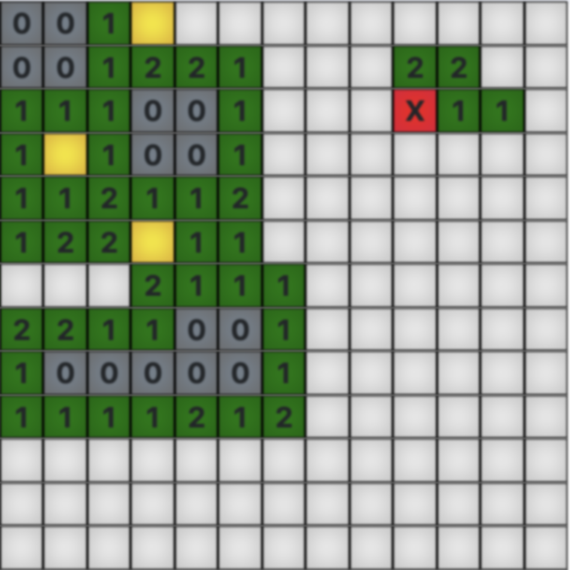

# ng-minesweeper
  

## Index ##

* [About](#about)
* [Demo](#demo)
* [Future Plans](#future-plans)

## About

AngularJS implementation of the classic Minesweeper game.

* Visit [my website](https://jrquick.com) for me cool stuff!

## Demo

* Checkout [the demo](https://minesweeper.jrquick.com).

## Future Plans

* Add documentation to README
* Add border and colors to buttons in settings
